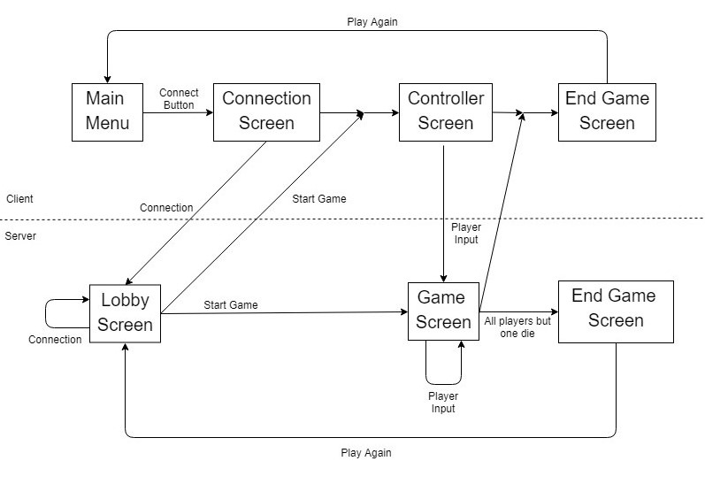

# XLPOOLsion
Second project developed in the LPOO course unit.

# Architecture Design

## Package and class diagram

## Predicted server-client interactions

## Expected Design Patterns

# GUI
## Listing of main functionalities:
* Client:
  * Connection to remote server via abstracted game code representing server IP adress
  * Controls screen that allows the user to control its respective character
  * Instructions screen with information about how to play the game
* Server:
  * Lobby screen that shows the game code while waiting for the players to connect
  * Game screen that shows all the participating players and the game world
  * End game screen that shows the winning player and statistics on the game

## Mockups:

### Mobile Client Mockup

### Desktop Server Mockup

