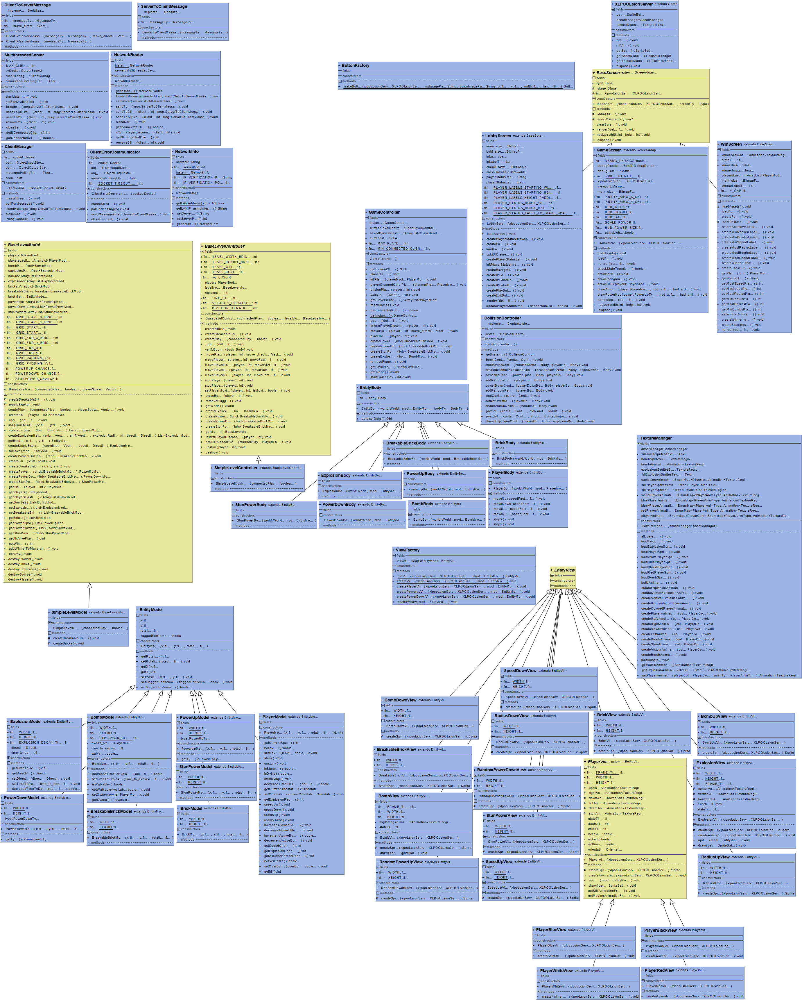

# Bombin' Man
Second project developed in the LPOO course unit.
**Contributors:**
* Miguel Duarte, up201606298, [@miguelpduarte](https://github.com/miguelpduarte)
* António Cruz, up201603526, [@AntoniooCruz](https://github.com/AntoniooCruz)
* Group 4 of Class 1

## Course unit info
* **Date:** 2nd Year, 2nd Semester, 2017/2018
* **Topic:** Final project for the course
* **Course:** Laboratório de Programação Orientada a Objectos (LPOO) | OOP Lab
* **Course Link:** https://sigarra.up.pt/feup/pt/ucurr_geral.ficha_uc_view?pv_ocorrencia_id=399895

## Full project source-code, including unit tests
The source code is in this repository, under the XLPOOLsion-client and XLPOOLsion-server directories.

## Platform-specific executable file
* Android: 
* Desktop: 

## Javadoc documentation files
https://web.fe.up.pt/~up201606298/LPOO_second_delivery/

## Setup/Installation procedure
1. Open the BombingMan_server.jar file to start running the server
1. Install the app in the mobile clients using the provided apk
1. Connect to the shown IP using the mobile client (enter the connect screen and enter the IP, zero padded to the left)
    1. For example, 192.168.1.5 would be 192168001005
    1. After entering the IP using the keypad, press Connect
    1. Verify that you are connected by observing the screen change in mobile and the player state indication in the desktop app
1. Press the play button in the server application (minimum of 2 players connected for the game to start)
1. Control the characters using the mobile app as a controller
1. Have fun!

## Development documentation

## User Manual

## Full Server UML

## Full Android UML

